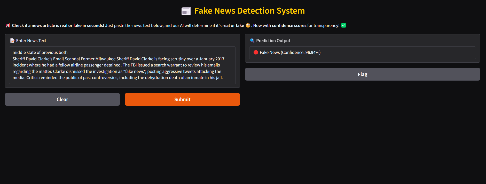
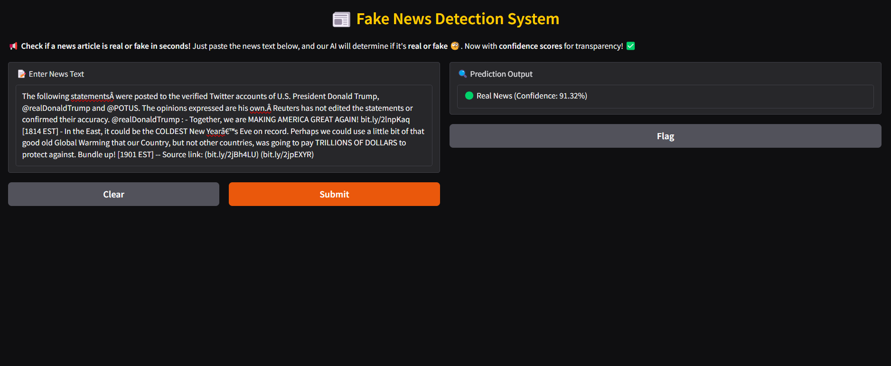

# 📰 Fake News Detection using Machine Learning

## 📸 Project Preview  
  
  

## 📖 Overview  
This project leverages **Natural Language Processing (NLP)** and **Machine Learning** to classify news content as either fake or real. It uses a **Logistic Regression** model trained on labeled news data, with **TF-IDF vectorization** for text processing. The model is deployed with **Gradio**, providing a clean and user-friendly web interface to test the system in real-time.

## 🚀 Features  
✅ Detects fake news using a trained **Logistic Regression** model  
✅ Utilizes **TF-IDF** vectorization for effective text feature extraction  
✅ Built using **Python**, **Scikit-learn**, **NLTK**, and **Gradio**  
✅ Simple and interactive **web interface** via Gradio  

## 🛠 Tech Stack  
| Category              | Tools / Technologies                         |
|-----------------------|----------------------------------------------|
| Programming Language  | Python 🐍                                    |
| ML Libraries          | Scikit-learn, Pandas, NumPy                  |
| NLP Toolkit           | NLTK                                         |
| Feature Engineering   | TF-IDF Vectorizer                            |
| Model                 | Logistic Regression                          |
| Web Interface         | Gradio                                       |

## 🔧 Installation & Usage  

### 📌 Prerequisites  
- Python 3.x 
- Basic understanding of Jupyter Notebook (for development)
- Gradio (for deploying the web interface)

